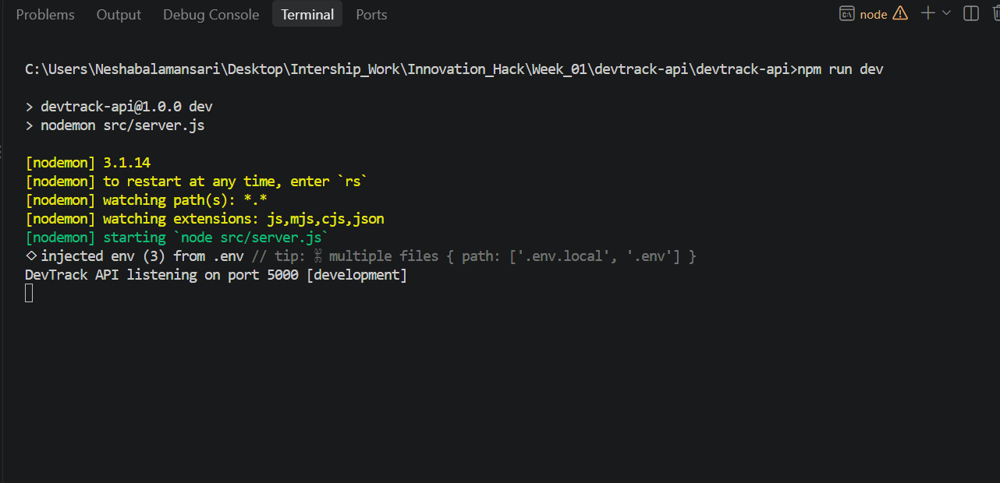
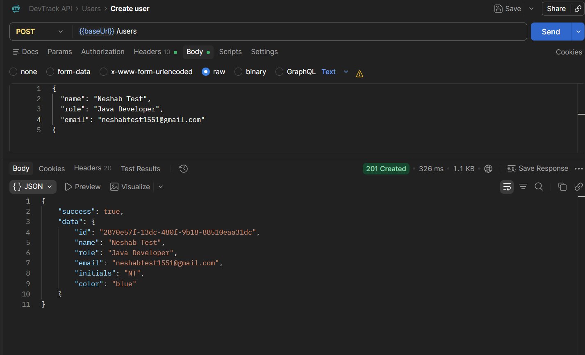
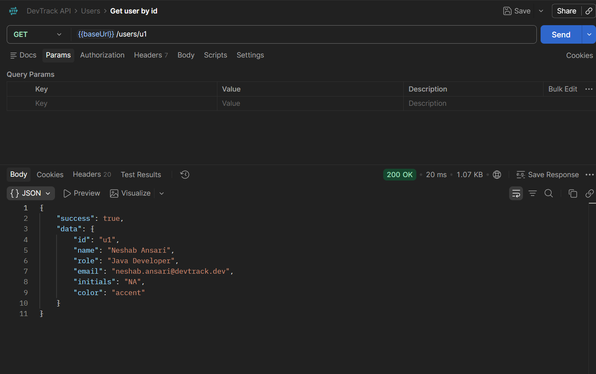
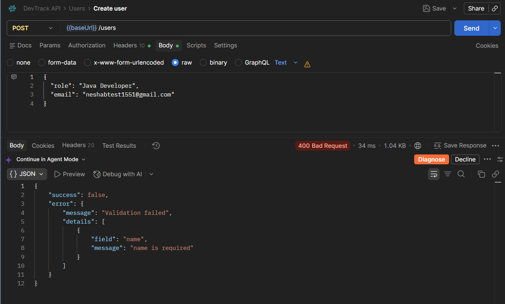

# DevTrack API

Task 2 of the Innovation Hacks Full Stack Development Internship: a REST API for
users, projects, and tasks — the backend the DevTrack dashboard (Task 1) and the
final platform (Task 4) will run on.

## Features

- Full CRUD for Users, Projects, and Tasks
- Dedicated endpoint to update just a task's status (`PATCH /tasks/:id/status`)
- Query-based filtering on task list (`status`, `projectId`, `assigneeId`, `priority`, `search`) and project list (`status`)
- Centralized input validation on every write endpoint, with field-level error messages
- Centralized error handling with consistent JSON error responses and correct HTTP status codes
- Referential integrity checks — rejects tasks with an unknown `projectId`/`assigneeId`, and projects with unknown `memberIds`
- Cascading delete — removing a project also removes its tasks
- Environment-based configuration via `.env`, with no hardcoded secrets
- Security middleware (`helmet`) and configurable CORS
- Request logging via `morgan`

## Tech stack

- **Node.js + Express 5** — HTTP server and routing
- **express-validator** — request validation on every write endpoint
- **helmet** + **cors** — baseline security headers and cross-origin config
- **morgan** — request logging
- **dotenv** — environment-based configuration

## Data layer

This task is scoped to API design, not persistence. Data lives in an in-memory
store (`src/data/store.js`) seeded with sample users, projects, and tasks, using
the same field names as the Task 1 dashboard's mock data. Task 3 replaces this
module with a real database (MongoDB/MySQL/PostgreSQL) — routes and controllers
won't need to change shape when that happens.

**Note:** because storage is in-memory, all data resets whenever the server
restarts.

## Getting started

```bash
npm install
cp .env.example .env
npm run dev
```

The API starts on `http://localhost:5000` by default (see `.env`).

- `npm run dev` — start with nodemon (auto-restart on file changes)
- `npm start` — start normally

## Environment variables

| Variable      | Description                                   | Default                 |
|---------------|------------------------------------------------|--------------------------|
| `PORT`        | Port the server listens on                     | `5000`                   |
| `NODE_ENV`    | `development` \| `production` \| `test`        | `development`             |
| `CORS_ORIGIN` | Allowed origin for browser requests             | `http://localhost:5173`  |

See `.env.example` for a ready-to-copy template. Never commit a real `.env` file.

## API overview

All routes are prefixed with `/api`. Every response is JSON shaped as either
`{ "success": true, "data": ... }` or `{ "success": false, "error": { "message": ... } }`.

### Health

| Method | Route         | Description        |
|--------|---------------|---------------------|
| GET    | `/api/health` | Liveness check      |

### Users

| Method | Route             | Description             |
|--------|-------------------|--------------------------|
| GET    | `/api/users`      | List all users           |
| GET    | `/api/users/:id`  | Get a single user        |
| POST   | `/api/users`      | Create a user            |
| PATCH  | `/api/users/:id`  | Update a user            |
| DELETE | `/api/users/:id`  | Delete a user            |

**Create/update body:** `name` (required), `role` (required), `email` (required,
unique), `color` (optional).

### Projects

| Method | Route                | Description                              |
|--------|----------------------|--------------------------------------------|
| GET    | `/api/projects`      | List projects — optional `?status=` filter |
| GET    | `/api/projects/:id`  | Get a single project                       |
| POST   | `/api/projects`      | Create a project                           |
| PATCH  | `/api/projects/:id`  | Update a project                           |
| DELETE | `/api/projects/:id`  | Delete a project (also deletes its tasks)  |

**Create/update body:** `name` (required), `key` (required, unique), `description`,
`status` (`planning` \| `active` \| `paused` \| `completed`), `progress` (0–100),
`dueDate` (ISO date), `memberIds` (array of existing user ids).

### Tasks

| Method | Route                    | Description                                             |
|--------|--------------------------|-----------------------------------------------------------|
| GET    | `/api/tasks`             | List tasks — filter by `status`, `projectId`, `assigneeId`, `priority`, `search` |
| GET    | `/api/tasks/:id`         | Get a single task                                          |
| POST   | `/api/tasks`             | Create a task                                               |
| PATCH  | `/api/tasks/:id`         | Update a task                                               |
| PATCH  | `/api/tasks/:id/status`  | Update only a task's status                                 |
| DELETE | `/api/tasks/:id`         | Delete a task                                               |

**Create/update body:** `title` (required), `projectId` (required, must reference
an existing project), `status` (`todo` \| `in-progress` \| `done`), `priority`
(`low` \| `medium` \| `high` \| `urgent`), `assigneeId` (must reference an
existing user), `dueDate` (ISO date).

## Error handling

All errors — validation failures, not-found lookups, and unexpected server
errors — go through a single centralized error handler
(`src/middleware/errorHandler.js`) and are returned as:

```json
{
  "success": false,
  "error": {
    "message": "Validation failed",
    "details": [{ "field": "name", "message": "name is required" }]
  }
}
```

HTTP status codes are used meaningfully throughout: `200` (OK), `201` (created),
`204` (deleted, no content), `400` (validation/bad input), `404` (not found),
`500` (unexpected server error).

## Testing the API

A ready-to-import Postman collection is included at
[`postman/DevTrack-API.postman_collection.json`](postman/DevTrack-API.postman_collection.json),
covering every endpoint above with example request bodies.

## Screenshots

> Add screenshots here before submitting. Suggested captures:

- Server startup log in the terminal (`npm run dev`)
- A successful `POST` request in Postman (e.g. Create user) showing the `201 Created` response
- A validation error response (e.g. missing required field) showing the `400` and error details
- A `404` response for a non-existent resource
- The Postman collection imported, showing all folders/endpoints in the sidebar






## Project structure

```
src/
  config/
    env.js              # Centralized environment variable access
  controllers/
    users.controller.js
    projects.controller.js
    tasks.controller.js
  data/
    store.js            # In-memory data store (swapped for a DB in Task 3)
  middleware/
    validate.js          # Turns express-validator errors into a 400
    notFound.js           # 404 handler for unmatched routes
    errorHandler.js        # Centralized error -> JSON response handler
  routes/
    index.js              # Mounts /users, /projects, /tasks under /api
    users.routes.js
    projects.routes.js
    tasks.routes.js
  utils/
    ApiError.js            # Error class carrying an HTTP status code
    asyncHandler.js          # Promise-rejection -> next(err) wrapper
  validators/
    user.validators.js
    project.validators.js
    task.validators.js
  app.js                      # Express app + middleware wiring
  server.js                    # Entry point — starts the HTTP server
```
